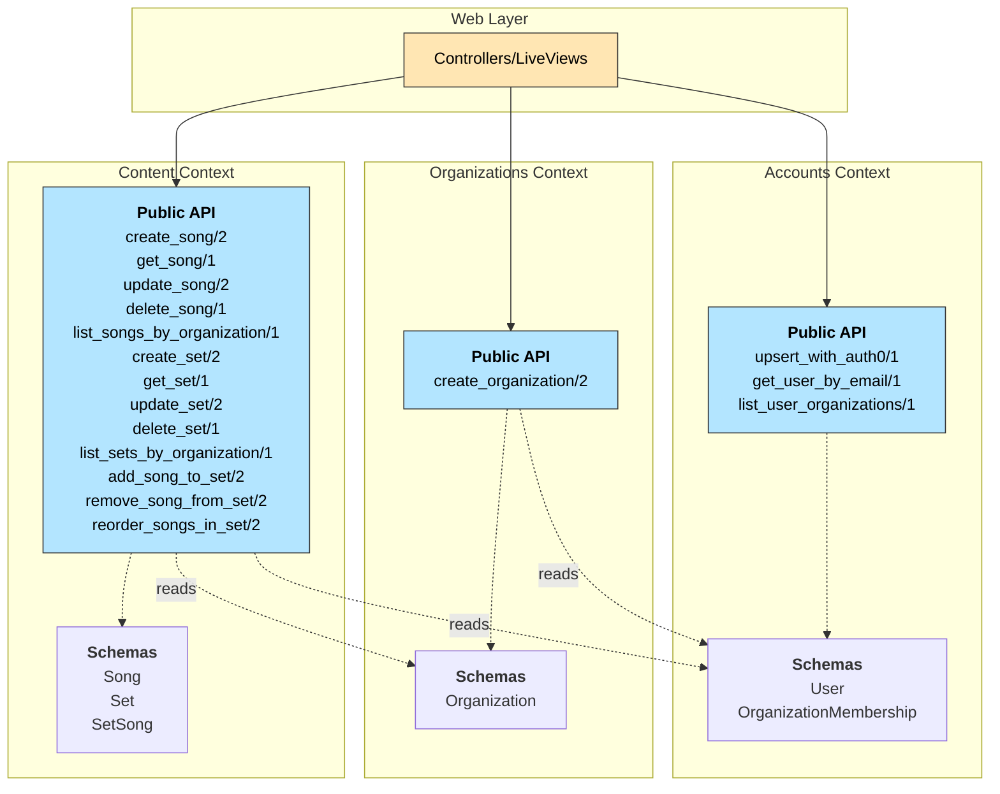

# Phoenix Context Architecture



## Context Responsibilities

### Accounts Context

**Purpose**: Manages users and their relationships to organizations (memberships).

**Module**: `MobileWorship.Accounts`

**Schemas**:

- `User` - User accounts synced from Auth0
- `OrganizationMembership` - Join table with role information

**Key Responsibilities**:

- Syncing users from Auth0 (upsert on login)
- Finding users by ID or email
- Querying user's organizations
- Managing organization memberships

**Public API Functions**:

- `upsert_with_auth0(auth0_user)` - Find user by auth0_id and update from Auth0, or create new user with Personal org
- `get_user(id)` - Get user by ID
- `get_user_by_email(email)` - Find user by email
- `list_user_organizations(user_id)` - Get all organizations a user belongs to
- `create_membership(user_id, org_id, role)` - Add user to organization with role (used internally by upsert_with_auth0)
- `update_membership_role(user_id, org_id, role)` - Change user's role in organization (future use)
- `delete_membership(user_id, org_id)` - Remove user from organization (future use)

---

### Organizations Context

**Purpose**: Manages organizations and their settings.

**Module**: `MobileWorship.Organizations`

**Schemas**:

- `Organization` - Organization/tenant entity

**Key Responsibilities**:

- Creating organizations (called during user signup to create "Personal" org)
- Organization entity management (delegates to Accounts for membership records)

**Public API Functions**:

- `create_organization(user_id, attrs)` - Create org and add user as owner (called during user signup)

---

### Content Context

**Purpose**: Manages songs, sets, and their relationships.

**Module**: `MobileWorship.Content`

**Schemas**:

- `Song` - Individual worship songs with parts/slides
- `Set` - Collection of songs with ordering
- `SetSong` - Join table for many-to-many relationship

**Key Responsibilities**:

- Song CRUD operations within an organization
- Set CRUD operations within an organization
- Managing song-to-set relationships
- Ordering songs within sets

**Public API Functions**:

- `create_song(user_id, attrs)` - Create a new song
- `get_song(id)` - Get song by ID
- `update_song(song, attrs)` - Update song details
- `delete_song(song)` - Delete song
- `list_songs_by_organization(org_id, opts \\ [])` - List all songs in an organization
- `create_set(user_id, attrs)` - Create a new set
- `get_set(id)` - Get set by ID
- `get_set_with_songs(id)` - Get set with preloaded songs in order
- `update_set(set, attrs)` - Update set details
- `delete_set(set)` - Delete set
- `list_sets_by_organization(org_id, opts \\ [])` - List all sets in an organization
- `add_song_to_set(set_id, song_id)` - Add song to set
- `remove_song_from_set(set_id, song_id)` - Remove song from set
- `reorder_songs_in_set(set_id, song_ids)` - Update the song_order array

---

## Cross-Context Communication

### Rules

1. **Web Layer** → **Contexts**: Controllers/LiveViews only call public context functions
2. **Context** → **Context**: Contexts can call other contexts' public APIs
3. **No Direct Schema Access**: Web layer never imports or queries schemas directly
4. **Authorization**: Each context function should accept user_id/org_id and verify permissions

### Dependencies

- `Organizations` may read from `Accounts` schemas (to get user info for members)
- `Content` may read from `Organizations` schemas (to verify org exists)
- `Content` may read from `Accounts` schemas (to verify creator exists)

### Example Flow: User Authentication with Auth0

1. User signs in via Auth0
2. Auth0 callback calls `Accounts.upsert_with_auth0(auth0_user)`
3. `Accounts.upsert_with_auth0/1`:
   - Looks up user by `auth0_id`
   - If found, updates user info (email_verified, name, picture, etc.)
   - If not found, creates user AND calls `Organizations.create_organization(user_id, %{name: "Personal"})`
   - Returns `{:ok, user}` or `{:error, changeset}`
4. User is authenticated and redirected to dashboard

### Example Flow: Creating a Song

1. User submits form in LiveView
2. LiveView calls `Content.create_song(user_id, attrs)`
3. `Content.create_song/2`:
   - Validates user has permission in the organization
   - Creates song record with `created_by_id` and `organization_id`
   - Returns `{:ok, song}` or `{:error, changeset}`
4. LiveView handles result and updates UI

---

## Authorization Strategy

For MVP, authorization is simple since each user has their own "Personal" organization:

```elixir
# In Content context
def create_song(user_id, attrs) do
  org_id = attrs["organization_id"]

  # Verify user has access to this organization
  case Accounts.list_user_organizations(user_id) do
    orgs when is_list(orgs) ->
      if Enum.any?(orgs, fn org -> org.id == org_id end) do
        %Song{}
        |> Song.changeset(Map.put(attrs, "created_by_id", user_id))
        |> Repo.insert()
      else
        {:error, :unauthorized}
      end
    _ ->
      {:error, :unauthorized}
  end
end
```

Future: When adding organization sharing, implement role-based authorization checks.

---

## Notes

- **Multi-tenancy**: All queries in `Content` context should be scoped by `organization_id` to ensure data isolation
- **Soft Deletes**: Consider if you need soft deletes for songs/sets (not shown in current schema)
- **Audit Trail**: `created_by_id` fields provide basic audit trail; consider adding `updated_by_id` if needed
- **Preloading**: Context functions that return data should offer options for preloading associations (e.g., `preload: [:songs]`)
- **Pagination**: List functions should support pagination options for large datasets
