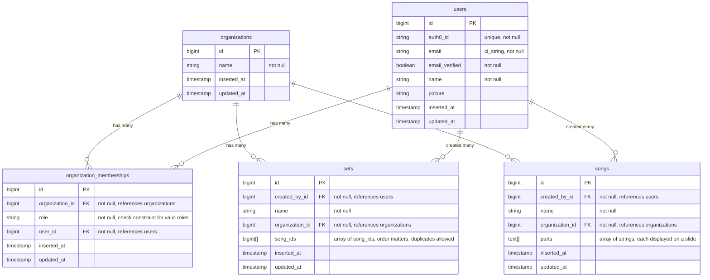

# Database Schema

## Notes

- **Default Organization Creation**: When a user signs up via Auth0, the application should automatically create a default organization for them with `name = "Personal"` and add them as the owner in `organization_memberships`. This ensures every user has at least one organization to work with immediately. Users can rename their organization later if needed.
- **Indexes**: Add indexes on: `users.auth0_id` (authentication lookups), `songs.organization_id` (filtering songs by org), `sets.organization_id` (filtering sets by org), `songs.created_by_id` (filtering by creator), `sets.created_by_id` (filtering by creator), `organization_memberships.user_id` (user lookups), `organization_memberships.organization_id` (org member lookups).
- **organization_memberships**: This is a join table with additional attributes (not just a simple join table with two foreign keys). It has its own primary key and includes the `role` field, making it a resource in the application with its own business logic. This allows users to have different roles (owner, viewer, etc.) within an organization. Should have a unique constraint on `(user_id, organization_id)` to prevent duplicate memberships.
- **organization_memberships.role**: Use a CHECK constraint to enforce valid role values (e.g., `CHECK (role IN ('owner', 'editor', 'viewer'))`). This keeps the database column as a simple string while ensuring data integrity.
- **sets.song_ids**: This array stores the order of song_ids. A song_id can appear multiple times in this array if the song needs to be performed multiple times in the set.
