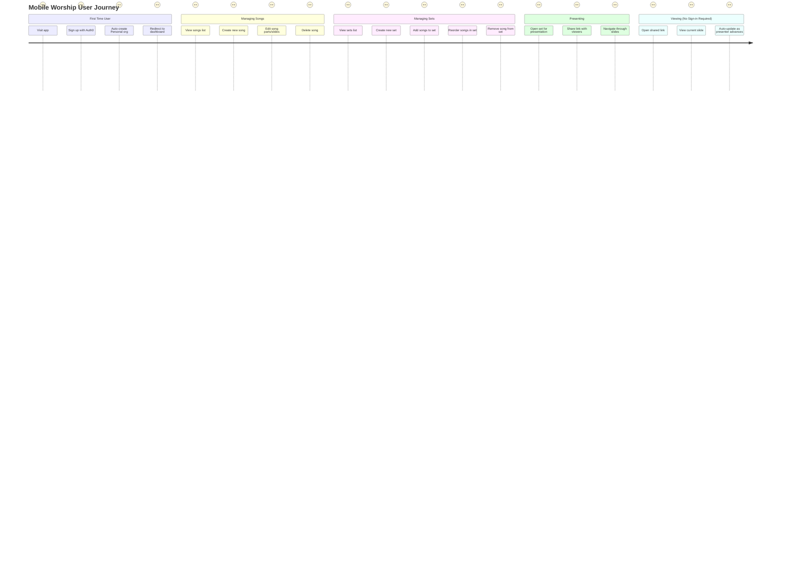

# User Journey

## User Journey Map

---

## Journey Notes

- **Actors**: Show which systems/contexts are involved in each step
- **First Time Experience**: Seamless onboarding with automatic Personal organization creation
- **Core Workflows**: Song and Set management are the primary user activities
- **Presentation Flow**: Presenter controls slides and shares a link with viewers
- **Viewing Experience**: No sign-in required for viewers; slides auto-update via WebSocket
- **End Goal**: Presenting worship content with synchronized viewing across multiple devices
